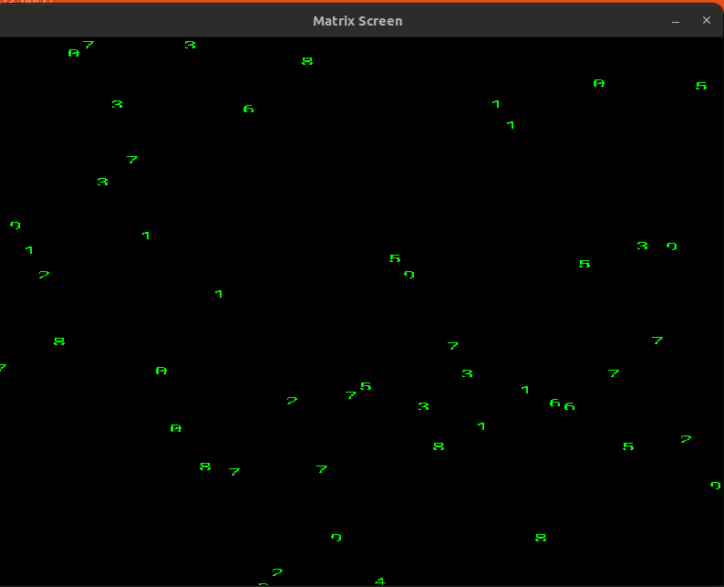
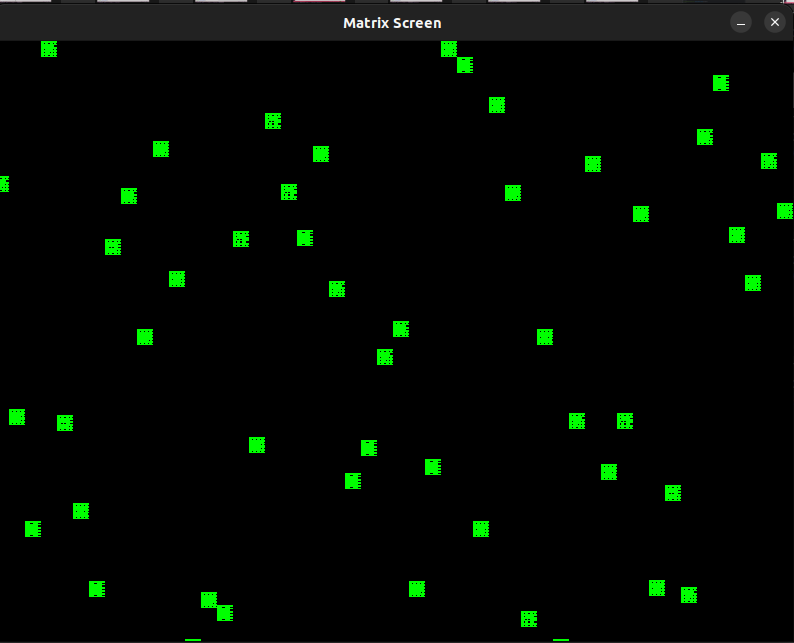
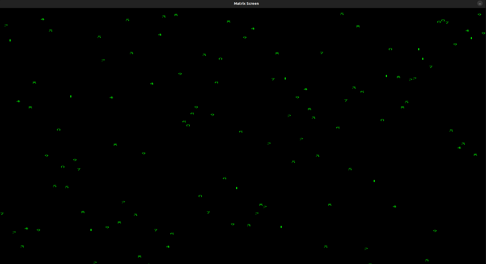

# Matrix Screen Animation

This is a simple C++ program that creates a Matrix-style animation on the screen using SDL2 and SDL_ttf libraries.

## Setup Instructions

To run this application, you'll need:

1. C++ compiler(g++ or clang++)
2. SDL2 library
3. SDL_ttf library

### Installing SDL2 and SDL_ttf

If you haven't installed SDL2 and SDL_ttf libraries, you can install them using your package manager. For example, on Ubuntu:

```bash
sudo apt-get update
sudo apt-get install libsdl2-dev libsdl2-ttf-dev
```

### Downloading the font file

Choose a font file (e.g., `arial.ttf`) to use for rendering characters on https://fonts.google.com/?query=roboto+mono or other font websites. 
Download the font file and extract it in the project 'fonts' directory.


### How it Works
The program creates a Matrix-style animation on the screen, simulating falling characters. Here's how it works:

1.**Initialization:**

The program initializes SDL2 for graphics rendering and SDL_ttf for text rendering.
It creates a window and a renderer for rendering graphics.
It loads a font to render characters.

2.**Matrix Column Structure:**

The MatrixColumn struct represents a column in the matrix animation. It contains members for the column's position (x, y) and speed (speed).

3.**Initializing Matrix Columns:**

The initMatrixColumns function initializes the matrix columns by setting their initial positions and speeds.

4.**Rendering Matrix:**

The renderMatrix function renders the matrix animation on the screen.
It generates random characters and renders them at appropriate positions to simulate falling characters.

5.**Event Handling:**

The program continuously polls for SDL events.
If the user closes the window, the program exits.

6.**Main Loop:**

The main loop of the program clears the screen, renders the matrix animation, updates the display, and adds a delay to control the frame rate.
#### Running the Application
After installing the required libraries, navigate to the project directory and build the application using CMake:
```bash
cd Matrix_Screen
cmake -S . -B build
cmake --build build
./build/MatrixScreen
```

### How it looks (Example)



(With a different font file)



(We can change the screen size and how fast the characters fall by using different settings for height, width, and speed)


#### Environment I used

- IDE: CLion
- OS: Linux Ubuntu
